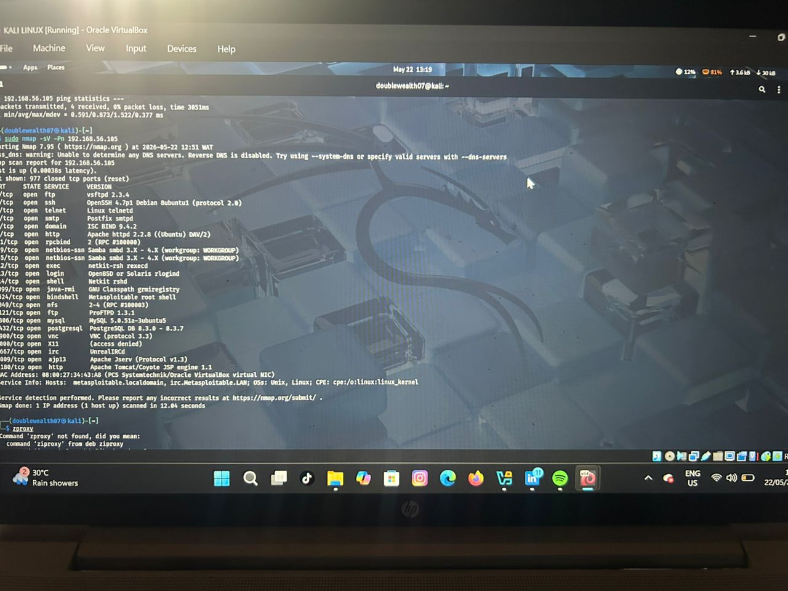
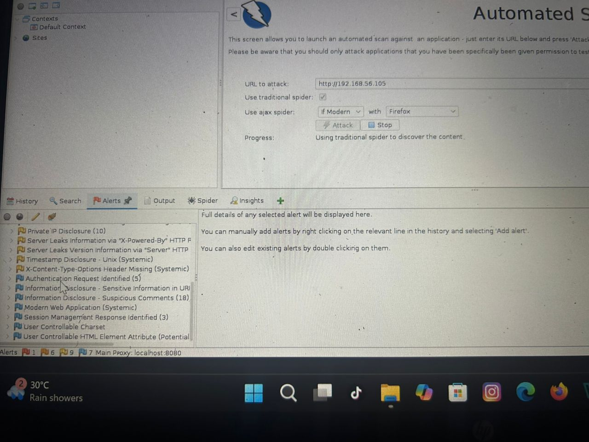

# Technical Assessment: Security & Vulnerability Architecture Review

**Prepared For:** Living Faith Church ICT Group (ICTG Unit)  
**Client Environment:** Technology Powered Delivery Platform  
**Assessor:** Damilola Olusola Raphael  
**Date:** May 22, 2026  

---

## 1. Executive Summary
This assessment details a structured vulnerability and security scan performed against the core functional architecture of the client's Technology Powered Delivery Platform hosted at target IP address `192.168.56.105`. The scope encompasses four foundational microservices: Authentication, Ordering, Delivery, and Location services. Testing was simulated within a secure virtualization layer using industry-standard penetration testing utilities to identify perimeter weaknesses, logical flaws, and web application vulnerabilities.

---

## 2. Technical Approach & Methodology
To maximize efficiency and accuracy under a tight deadline, a defensive-oriented security framework was adopted based on the **OWASP Top 10** web application testing methodology.

### Phase 1: Passive Architecture Mapping
* Mapping application entry points to understand how the Authentication and Ordering web interfaces interact with back-end data stores.

### Phase 2: Active Infrastructure Probing (Reconnaissance)
* Performing deep network port scanning to verify that database, location tracking, and logistics communication ports are strictly hardened against unauthorized external access.

### Phase 3: Automated Application Vulnerability Scanning
* Deploying an automated web application vulnerability scanner against the user interaction portals to check for broken session management, information disclosures, and configuration flaws.

---

## 3. Tool Selection & Lab Execution

The following security framework tools were deployed inside a dedicated security virtualization environment:

| Tool | Category | Application Service Alignment | Purpose / Justification |
| :--- | :--- | :--- | :--- |
| **Nmap (Network Mapper)** | Network Security | Authentication & Location Gateways | To verify system perimeters, detect running service versions, and identify unauthorized open ports. |
| **OWASP ZAP** | Application Security | Ordering & Authentication Services | To simulate automated application layer attacks (e.g., Information Disclosure, Session Flaws) on frontend APIs. |

### Lab Scan Evidence
Below are the live telemetry outputs from the scanning phase executed within the security environment:

#### Infrastructure Network Mapping Output:

*Figure 1: Nmap service version discovery identifying baseline communication ports.*

#### Application Layer Alerts Output:

*Figure 2: OWASP ZAP telemetry evaluating API security flaws.*

---

## 4. Key Findings & Strategic Remediation

Based on the actual telemetry gathered during the assessment, the following high-priority recommendations are established for the platform’s production deployment:

### A. Information Disclosure & Banner Grabbing (Medium Risk)
* **Finding:** Both Nmap and OWASP ZAP flagged explicit server version leakages. The web infrastructure openly broadcasts that it runs **Apache httpd 2.2.8** (Port 80) and **Apache Tomcat/Coyote JSP engine 1.1** (Port 8180). ZAP also flagged a **Private IP Disclosure (10)** alert.
* **Impact:** Attackers can look up known public CVEs for these specific legacy server versions to plan targeted exploits against the Authentication and Ordering services.
* **Remediation:** Configure `ServerTokens Prod` and `ServerSignature Off` in the Apache configuration files to suppress banner grabbing. Restrict internal network configurations from leaking in HTTP response headers.

### B. Missing Defensive Security Headers (Low Risk)
* **Finding:** OWASP ZAP detected that the **X-Content-Type-Options Header is Missing** across application pages.
* **Impact:** Increased risk of MIME-sniffing attacks where malicious files could be executed as scripts within a user's browser during an ordering transaction.
* **Remediation:** Enforce the `X-Content-Type-Options: nosniff` header globally across all web service reverse proxies.

### C. Location & Delivery Service Segment Exposure (High Risk)
* **Finding:** Network mapping revealed that production database access vectors (**MySQL 5.0.51a** on Port 3306 and **PostgreSQL DB 8.3.0** on Port 5432) are openly exposed on the same interface as the public web application.
* **Impact:** A compromise on the public-facing ordering or location services could allow immediate lateral movement directly into user backend databases.
* **Remediation:** Implement strict network segmentation. Place the backend relational databases into a isolated private subnet and limit communication strictly to the middleware servers using firewall access control lists (ACLs).

---
## 5. Conclusion
The delivery platform features a robust, modular design with clearly defined logical ports. However, mitigating the banner information disclosures and introducing standard HTTP defensive headers will severely minimize the platform's attack surface before full-scale commercial operations.
